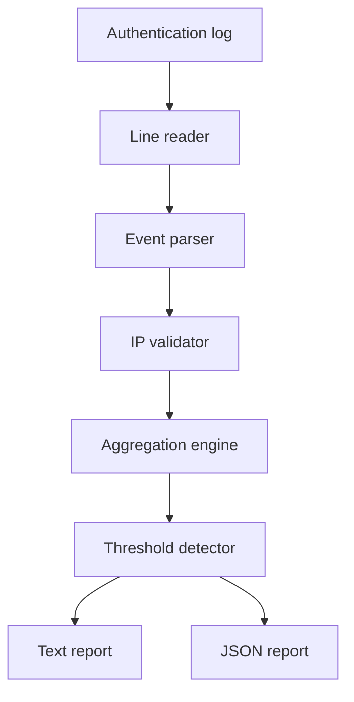
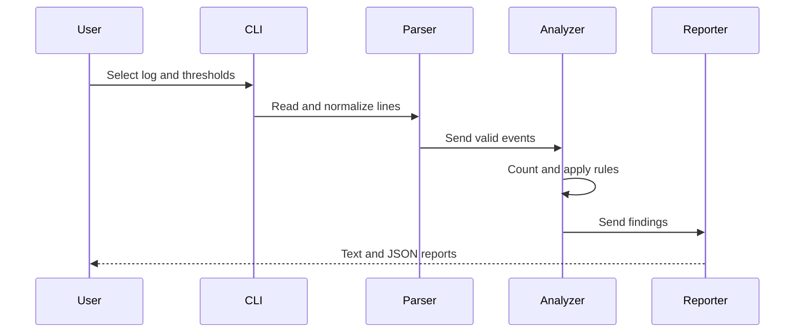

# System Architecture

## Overview

## Components

| Component | Responsibility |
| --- | --- |
| CLI controller | Accepts input, thresholds, and output paths |
| Line reader | Reads the file safely and counts unrecognized lines |
| Event parser | Converts supported messages into normalized events |
| IP validator | Rejects malformed source addresses |
| Aggregation engine | Counts activity and targeted usernames by IP |
| Threshold detector | Marks findings and records clear reasons |
| Report generator | Produces text and JSON evidence |

## Event Model

Each recognized message becomes a `LogEvent` with:

- Source line number
- Event type
- Valid source IP address
- Optional username
- Optional source port

This normalization separates log-format parsing from threat-analysis rules.

## Processing Sequence

## Detection Rules

| Observation | Rule | Result |
| --- | --- | --- |
| Failed passwords from one IP | Count ≥ failed threshold | Suspicious |
| Connections from one IP | Count ≥ connection threshold | Suspicious |
| Both rules reached | Record both explanations | Higher investigation priority |
| Neither rule reached | Retain count without alert | Not currently suspicious |

Failed and successful authentication messages also count as connection attempts
because they represent network interactions with the SSH service.

## Trust and Security Boundaries

- Input logs are treated as untrusted text.
- Extracted IP addresses are validated before aggregation.
- The analyzer never contacts, scans, or blocks an IP address.
- Findings are indicators requiring investigation, not proof of maliciousness.
- Output stays local unless the user intentionally shares it.
- Real logs may contain personal or operational information and should be
  anonymized before public upload.
